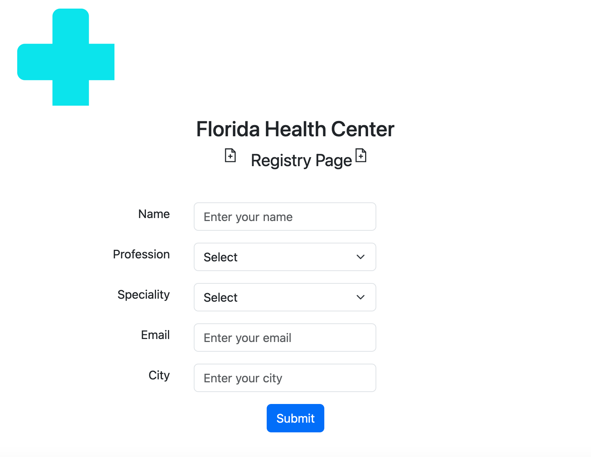

#  🚑 medical_project_frontend
<div align="center">
  
</div>


#### 📗 Table of Contents
- [🚑 medical\_project\_frontend](#-medical_project_frontend)
      - [📗 Table of Contents](#-table-of-contents)
    - [Medical Project Frontend ](#medical-project-frontend-)
  - [🛠 Built With ](#-built-with-)
    - [Tech Stack ](#tech-stack-)
    - [📕 Key Features ](#-key-features-)
  - [💻 Getting Started ](#-getting-started-)
    - [💪🏻 Setup](#-setup)
  - [👩🏽‍💻 Author ](#-author-)
  - [🤝 Contributing ](#-contributing-)
  - [⭐️ Show your support ](#️-show-your-support-)
  - [📝 License ](#-license-)

<!-- PROJECT DESCRIPTION -->

### Medical Project Frontend <a name="about-project"></a>

medical_project repository is built using a framework named **React**.
This is the Frontend part of the project. 
Components: Form.jsx and Header.jsx were created. 
Functions like handleSubmit, and validateForm, as well as React hooks like useState were used.

<br/>

## 🛠 Built With <a name="built-with"></a>

### Tech Stack <a name="tech-stack"></a>

<details>
<summary>REACTJS📕</summary>
  <ul>
    <li><a href="https://react.dev/">React</a></li>
  </ul>
  </details>
  <details>
      <summary>Bootstrap</summary>
      <ul>
          <li><a href="https://getbootstrap.com">Bootstrap</a></li>
    </ul>
    </details>
    <details>
      <summary>ReactBootstrap</summary>
      <ul>
          <li><a href="https://react-bootstrap.netlify.app">Bootstrap</a></li>
    </ul>
    </details>
    <details>
        <summary>Deployment site used: VERCEL</summary>
        <ul>
            <li><a href="https://vercel.com/">Vercel</a></li>
        </ul>
    </details>

### 📕 Key Features <a name="key-features"></a>

- **[separation of concerns principle]**

<p align="right">(<a href="#readme-top">back to top</a>)</p>

## 💻 Getting Started <a name="getting-started"></a>

To get a local copy up and running, follow these steps.

### 💪🏻 Setup

Clone this repository to your desired folder:

```sh
  cd my-folder
  git clone https://github.com/IvonneBenitesRodriguez/medical_project_frontend.git
```

<p align="right">(<a href="#readme-top">back to top</a>)</p>

## 👩🏽‍💻 Author <a name="author"></a>

🌸 **Authors** Ivonne Benites Rodriguez <br/>

- GitHub: [@githubhandle](https://github.com/IvonneBenitesRodriguez)
- Twitter: [@twitterhandle](https://twitter.com/IvonneBenitesR)
- LinkedIn: [LinkedIn](https://www.linkedin.com/in/ivonnebenites/)
  <br/>

<p align="right">(<a href="#readme-top">back to top</a>)</p>

<p align="right">(<a href="#readme-top">back to top</a>)</p>

## 🤝 Contributing <a name="contributing"></a>

Contributions, issues, and feature requests are welcome!

Feel free to check the [issues page](https://github.com/IvonneBenitesRodriguez/bakery_shop_site/issues).

<p align="right">(<a href="#readme-top">back to top</a>)</p>

## ⭐️ Show your support <a name="support"></a>

If you like this project, give it a start ⭐️ and a nice comment.

<p align="right">(<a href="#readme-top">back to top</a>)</p>

<!-- LICENSE -->

## 📝 License <a name="license"></a>

This project is [MIT](./LICENSE) licensed.

<p align="right">(<a href="#readme-top">back to top</a>)</p>
